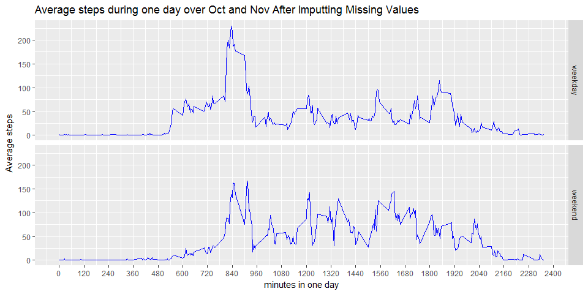

Abstract
--------

To understand the information or hidden information provided by
'Activity monitoring data', an exploratory analyse is completed. The
following questions are answered.

-   What is total number of steps taken per day?
-   What is mean total number of steps taken per day?  
-   What is median total number of steps taken per day?
-   What is the average daily activity pattern?  
-   Do these missing values impact on the estimates of the total daily
    number of steps? What is the impact if they do?  
-   Are there differences in activity patterns between weekdays and
    weekends?

The analyse shall be reproducible according to the report.

Raw Data
--------

This section illustrates what the raw data is, how do obtain the raw
data. The name of dataset is 'Activity monitoring data'. Its zip file
size is 52k and available at
[here](https://d396qusza40orc.cloudfront.net/repdata%2Fdata%2Factivity.zip).
There is a CSV file in the zip file.

The variables included in this dataset are:

**steps**: Number of steps taking in a 5-minute interval (missing values
are coded as NA)  
**date**: The date on which the measurement was taken in YYYY-MM-DD
format  
**interval**: Identifier for the 5-minute interval in which measurement
was taken

Data Process
------------

The following R code can download and unzip the zip file containing raw
data, also show the first 6 rows and basic information of the raw data.

    url <- "https://d396qusza40orc.cloudfront.net/repdata%2Fdata%2Factivity.zip"
    tempFileName <- "activity.csv"

    temp <- tempfile()
    download.file(url,temp)
    unzip(temp, tempFileName)
    activityData <- read.csv(tempFileName)
    unlink(temp)
    head(activityData)

    ##   steps       date interval
    ## 1    NA 2012-10-01        0
    ## 2    NA 2012-10-01        5
    ## 3    NA 2012-10-01       10
    ## 4    NA 2012-10-01       15
    ## 5    NA 2012-10-01       20
    ## 6    NA 2012-10-01       25

    str(activityData)

    ## 'data.frame':    17568 obs. of  3 variables:
    ##  $ steps   : int  NA NA NA NA NA NA NA NA NA NA ...
    ##  $ date    : Factor w/ 61 levels "2012-10-01","2012-10-02",..: 1 1 1 1 1 1 1 1 1 1 ...
    ##  $ interval: int  0 5 10 15 20 25 30 35 40 45 ...

The values of date column need to be converted into R date class.

    activityData$date <- as.Date(activityData$date, "%Y-%m-%d")
    str(activityData)

    ## 'data.frame':    17568 obs. of  3 variables:
    ##  $ steps   : int  NA NA NA NA NA NA NA NA NA NA ...
    ##  $ date    : Date, format: "2012-10-01" "2012-10-01" ...
    ##  $ interval: int  0 5 10 15 20 25 30 35 40 45 ...

Data Analyse
------------

This section describes the exploratory anaylse for activity data. The
above questions are answered in the section one by one.

### What is total number of steps taken per day?

In this process, missing values can be ignored. Therefore the subset
without missing values is created

The following R code generates the total number of steps taken per day.

    subNomissing <- subset(activityData, !is.na(activityData$steps), select=c("steps", "date", "interval"))
    aggregate(steps ~ date, subNomissing, sum, is.na(T))

    ##          date steps
    ## 1  2012-10-02   126
    ## 2  2012-10-03 11352
    ## 3  2012-10-04 12116
    ## 4  2012-10-05 13294
    ## 5  2012-10-06 15420
    ## 6  2012-10-07 11015
    ## 7  2012-10-09 12811
    ## 8  2012-10-10  9900
    ## 9  2012-10-11 10304
    ## 10 2012-10-12 17382
    ## 11 2012-10-13 12426
    ## 12 2012-10-14 15098
    ## 13 2012-10-15 10139
    ## 14 2012-10-16 15084
    ## 15 2012-10-17 13452
    ## 16 2012-10-18 10056
    ## 17 2012-10-19 11829
    ## 18 2012-10-20 10395
    ## 19 2012-10-21  8821
    ## 20 2012-10-22 13460
    ## 21 2012-10-23  8918
    ## 22 2012-10-24  8355
    ## 23 2012-10-25  2492
    ## 24 2012-10-26  6778
    ## 25 2012-10-27 10119
    ## 26 2012-10-28 11458
    ## 27 2012-10-29  5018
    ## 28 2012-10-30  9819
    ## 29 2012-10-31 15414
    ## 30 2012-11-02 10600
    ## 31 2012-11-03 10571
    ## 32 2012-11-05 10439
    ## 33 2012-11-06  8334
    ## 34 2012-11-07 12883
    ## 35 2012-11-08  3219
    ## 36 2012-11-11 12608
    ## 37 2012-11-12 10765
    ## 38 2012-11-13  7336
    ## 39 2012-11-15    41
    ## 40 2012-11-16  5441
    ## 41 2012-11-17 14339
    ## 42 2012-11-18 15110
    ## 43 2012-11-19  8841
    ## 44 2012-11-20  4472
    ## 45 2012-11-21 12787
    ## 46 2012-11-22 20427
    ## 47 2012-11-23 21194
    ## 48 2012-11-24 14478
    ## 49 2012-11-25 11834
    ## 50 2012-11-26 11162
    ## 51 2012-11-27 13646
    ## 52 2012-11-28 10183
    ## 53 2012-11-29  7047

The following shows histogram figure for total number of steps in one
day.

    library(ggplot2)
    sumNoMissing <- aggregate(steps ~ date, subNomissing, sum, is.na(T))
    ggplot(data=sumNoMissing, aes(sumNoMissing$steps)) +
        geom_histogram(aes(y = ..count..), fill="blue", alpha = .3, binwidth = 500) +
        scale_x_continuous(name = "Total number of Steps per day",
                           breaks= seq(0,24000,1000)) +
        scale_y_continuous(name = "Count") +
        labs(title="Histogram for Total Number of Steps per Day") 

The summary of total number of steps taken per day.

    summary(sumNoMissing)

    ##       date                steps      
    ##  Min.   :2012-10-02   Min.   :   41  
    ##  1st Qu.:2012-10-16   1st Qu.: 8841  
    ##  Median :2012-10-29   Median :10765  
    ##  Mean   :2012-10-30   Mean   :10766  
    ##  3rd Qu.:2012-11-16   3rd Qu.:13294  
    ##  Max.   :2012-11-29   Max.   :21194

### What is mean total number of steps taken per day?

The following calculates the mean total number of steps taken per day.

    mean(sumNoMissing$steps)

    ## [1] 10766.19

### What is median total number of steps taken per day?

The following calculates the median total number of steps taken per day.

    median(sumNoMissing$steps)

    ## [1] 10765

### What is the average daily activity pattern?

The following figure shows the 5-minute interval (x-axis) and the
average number of steps taken, averaged across all days (y-axis).

    average <- aggregate(subNomissing, by=list(subNomissing$interval), mean, na.rm=T)
    ggplot(data=average, aes(average$steps)) +
        geom_line(aes(x=average$interval, y = average$steps), col="blue")  +
        scale_x_continuous(name = "minutes in one day",
                            breaks= seq(0,2400,120)) +
        scale_y_continuous(name = "Average steps") +
        labs(title="Average steps during one day over Oct and Nov")

The maximum number of steps is 206.17 , it occurs at the 2012-10-30 th
minute of a day. Please see the following calculation.

    rowIndex <- which.max(average$steps)
    average[rowIndex, 2:3]

    ##        steps       date
    ## 104 206.1698 2012-10-30

### Do these missing values impact on the estimates of the total daily number of steps? What is the impact if they do?

Note that there are a number of days/intervals where there are missing
values (coded as NA). The presence of missing days may introduce bias
into some calculations or summaries of the data. To answer the above
question, the following operations are done.

1.  Calculate and report the total number of missing values in the
    dataset (i.e. the total number of rows with NAs)

<!-- -->

    nrow(activityData[is.na(activityData$steps),])

    ## [1] 2304

1.  Create a new dataset that is equal to the original dataset but with
    the missing data filled in. Fill the mean for that 5-minute interval
    in all of the missing values in the dataset.

<!-- -->

    completelyData <- activityData
    completelyData$steps[is.na(completelyData$steps)] <- as.integer(round(average$steps[match(completelyData$interval,average$interval)][which(is.na(completelyData$steps))],0))
    head(completelyData)

    ##   steps       date interval
    ## 1     2 2012-10-01        0
    ## 2     0 2012-10-01        5
    ## 3     0 2012-10-01       10
    ## 4     0 2012-10-01       15
    ## 5     0 2012-10-01       20
    ## 6     2 2012-10-01       25

    str(completelyData)

    ## 'data.frame':    17568 obs. of  3 variables:
    ##  $ steps   : int  2 0 0 0 0 2 1 1 0 1 ...
    ##  $ date    : Date, format: "2012-10-01" "2012-10-01" ...
    ##  $ interval: int  0 5 10 15 20 25 30 35 40 45 ...

1.  Make a histogram of the total number of steps taken each day and
    Calculate and report the mean and median total number of steps taken
    per day.

<!-- -->

    sumImput <- aggregate(steps ~ date, completelyData, sum)
    ggplot(data=sumImput, aes(sumImput$steps)) +
        geom_histogram(aes(y = ..count..), fill="blue", alpha = .3, binwidth = 500) +
        scale_x_continuous(name = "Total number of Steps per day",
                           breaks= seq(0,24000,1000)) +
        scale_y_continuous(name = "Count") +
        labs(title="Histogram for Total Number of Steps per Day with Replaced Missing Value")

These values differ from the estimates from the first part of the
assignment. The following table summarizes the difference.

<table>
<thead>
<tr class="header">
<th></th>
<th>with missing value</th>
<th>imput missing value</th>
</tr>
</thead>
<tbody>
<tr class="odd">
<td>Sum of steps</td>
<td>570608</td>
<td>656704</td>
</tr>
<tr class="even">
<td>Mean of steps</td>
<td>10766</td>
<td>10765</td>
</tr>
<tr class="odd">
<td>Median of steps</td>
<td>10765</td>
<td>10762</td>
</tr>
</tbody>
</table>

Apart from 'sum of steps' is increased, mean and median are not impacted
very much.

### Are there differences in activity patterns between weekdays and weekends?

To achieve this, firstly create a new factor variable in the dataset
with two levels - "weekday" and "weekend" indicating whether a given
date is a weekday or weekend day.

    weekdayOrWeekend <- factor(weekdays(completelyData$date) %in% c("Saturday","Sunday"), labels=c("weekday","weekend"), ordered=FALSE)

Secondly, make a panel plot containing a time series plot (i.e. type =
"l") of the 5-minute interval (x-axis) and the average number of steps
taken, averaged across all weekday days or weekend days (y-axis).

    averageImput <- aggregate(completelyData$steps, by=list(completelyData$interval, weekdayOrWeekend), mean)
    names(averageImput) <- c("interval", "weekdayOrWeekend", "stepsMean")
    ggplot(data=averageImput, aes(averageImput$stepsMean)) +
        geom_line(aes(x=averageImput$interval, y = averageImput$stepsMean), col="blue") +               
        facet_grid(weekdayOrWeekend ~ .) +  
        scale_x_continuous(name = "minutes in one day",
                            breaks= seq(0,2400,120)) +
        scale_y_continuous(name = "Average steps") +
        labs(title="Average steps during one day over Oct and Nov After Imputting Missing Values")

The maximun steps activity occured in weekday category, on the other
hand the majority steps were done in weekend.
